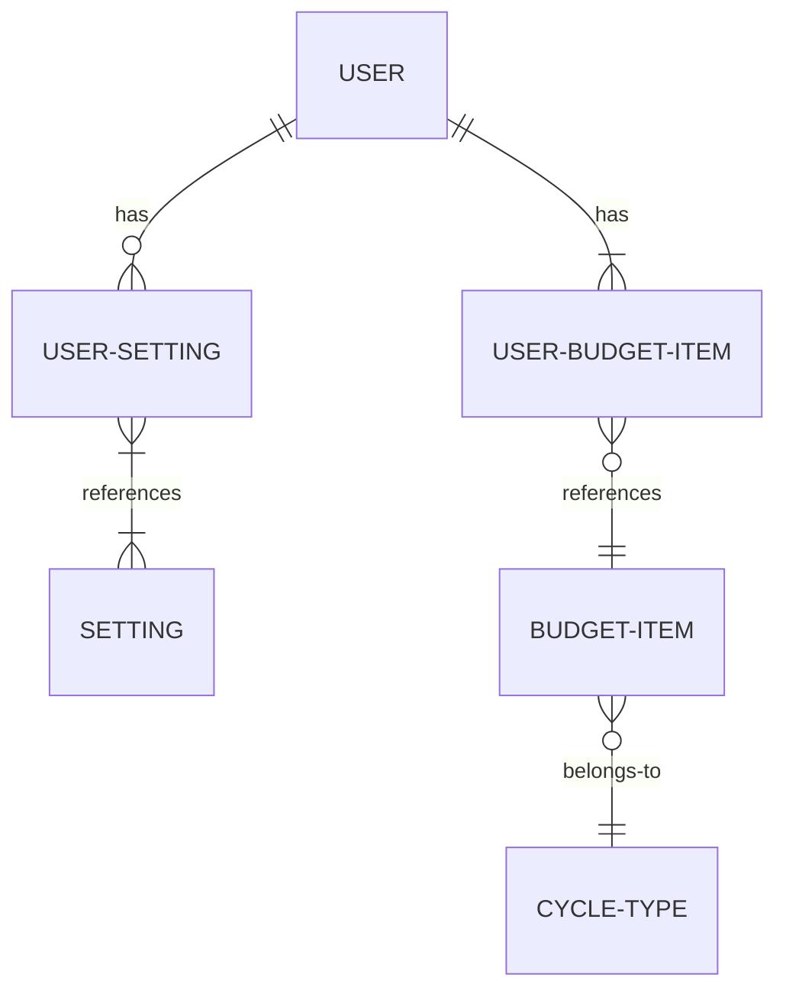
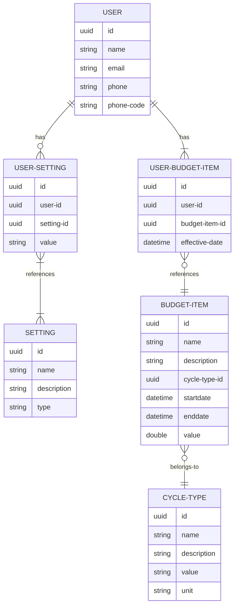

# Data

## Security Considerations

- Best means of securely storing sensitive user information? (Budget values & descriptions, Salary/Pay values)

## High Level Data Requirements

- User Data
  - User-Provided Data
    - Budget Items / Values
    - Pay / Salary Values
  - User-Login Data
- Application Data
  - Settings / Preferences
    - Pay Cycle
    - Darkmode Preference
    - Hide Values

## Anticipated Primary Data Entities

- User
- Budget-Item
- CYCLE-TYPE (day, week, month, etc.)
- Setting

## Anticipated Additional Considerations

- CYCLE-TYPEs may need to include specific logic like "First Monday of the Month"

## L0 Entity Relationship Diagram

## L1 Entity Relationship Diagram
